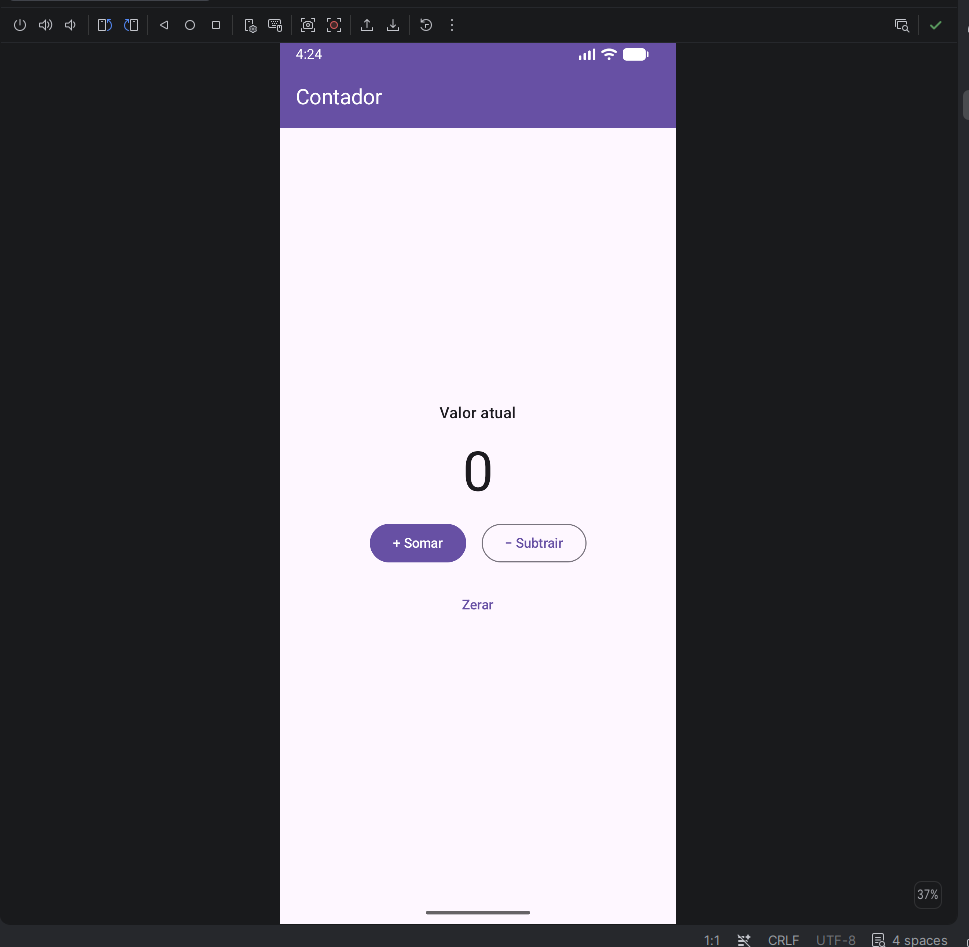
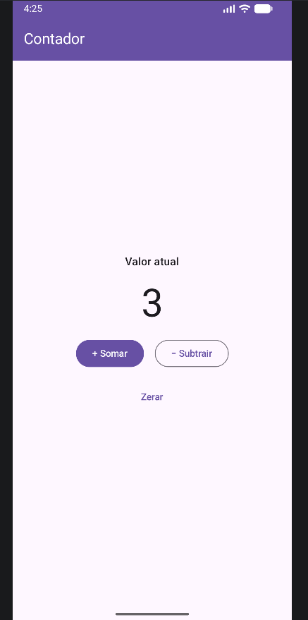
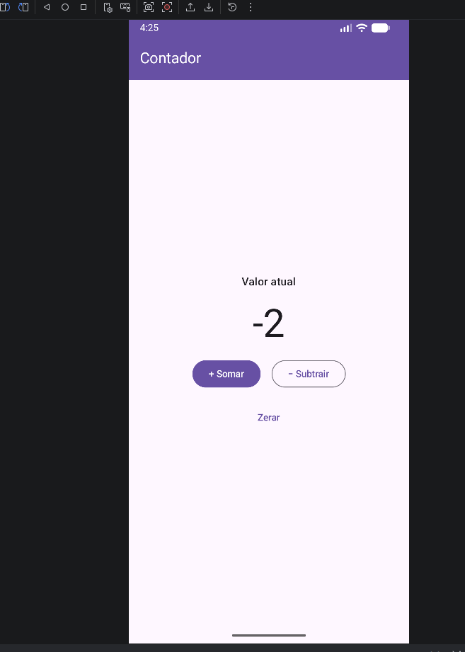

# Contador — Jetpack Compose

**Aluno:** Luigi Sapucaia

Aplicativo Android de tela única (Kotlin + Jetpack Compose + Material 3) que exibe um contador com botões para somar e subtrair.

## Como o estado funciona

O valor do contador é guardado em `rememberSaveable { mutableIntStateOf(0) }` dentro do composable `ContadorScreen`.
`mutableIntStateOf` cria um estado *observável*: o `Text` que exibe o número lê esse estado durante a composição, e o Compose registra essa leitura.
Quando um botão altera o valor (`contador++`, `contador--`), o Compose percebe a mudança e recompõe automaticamente apenas quem leu o estado, redesenhando o número sem nenhuma chamada explícita de "atualizar texto".
`remember` mantém o valor entre recomposições, e a versão `rememberSaveable` também o preserva quando a Activity é recriada (rotação de tela).

## Desafios opcionais implementados

- **D2** — Botão "Zerar" com estilo secundário (`TextButton`).
- **D3** — Valor preservado na rotação de tela com `rememberSaveable`.

## Como executar

Abra a pasta do projeto no Android Studio, aguarde o *Gradle Sync* e execute o módulo `app` em um emulador ou dispositivo.

## Captura de tela

App rodando no emulador do Android Studio:

| Valor inicial (0) | Após somar (3) | Após subtrair (-2) |
|---|---|---|
|  |  |  |

## Diário de IA

O diário de uso de IA desta entrega está em [`Diario_de_IA.docx`](Diario_de_IA.docx).
